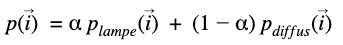

# Raytracing

Le but de ce rapport est de détailler les méthodes mises en place pour réaliser le développement d’un algorithme de raytracing. L’objectif est de créer et de simuler le comportement de la lumière afin de réaliser un rendu le plus réaliste (prise en compte de reflets, d’ombres, de réfraction etc …). Ce TP se décompose en plusieurs phase :

- 1 : La mise en place de méthodes de calcul d'intersection rayons-sphère et génération de lumière
- 2 : La mise en place d’ombres portées, de correction gamma, de surfaces spéculaires et transparentes.
- 3 : La mise en place de l’équation du rendu, d’intégration de Monte-Carlo et d’éclairage indirect.
- 4 : La mise en place d’anti-Aliasing, d’ombres douces, de différents modèles de caméra.
- 5 : La mise en place d’intersection rayon-plan, rayon-triangle, rayon-boite englobante, de gestion des maillages. Le but de toutes ces implémentations est de pouvoir travailler avec des formes plus complexes (maillages) et de diminuer les temps de calcul.

L’ensemble du code à été réalisé en C++. Ce code peut être trouvé en pièce jointe de ce rapport. Il est important de noter que certains visuels ont dû être réalisé lors de la rédaction de ce rapport. Certains visuels contiennent des éléments qui ont été implémentés plus taard dans le rapport.

## 1. Mise en place du projet

La première étape consiste à créer les classes élémentaires de notre projet :

- L’objet Vector qui permet de stocker triplet et qui est surchargé d’un ensemble de méthodes utiles par la suite.
- L’objet Sphère qui permet de modéliser une sphère dans une scène. Une sphère est définie par un centre, un rayon et une couleur.
- L’objet Ray qui permet de définir un rayon. Cet objet est une demi droite définie par une origine et une direction.
- L’objet Scene qui stockera la collection d’objets qui seront stockés dans notre scène.

Une fois ces objets créés (cf.code), il est possible de créer notre première scène qui consistera en 5 sphères (4 pour les murs et 1 pour l’objet à observer) conformément au schéma proposé en cours :

La lumière de la scène est ponctuelle.

Il est important de noter que pour pouvoir calculer les intéractions de la lumière, il est nécessaire de calculer l'ensemble des intersections entre les sphères et les rayons lumineux.

On a alors l'équation suivante à résoudre pour chaque rayon et chaque sphère :

Cette equation d'ordre 2 peut être résolue et ainsi détecter les points de rebond des rayons.

On implémente alors des fonctions intersect dans les classes Sphere et Scene afin de calculer toutes ces intersections

Une fois l'ensemble de ces objets initialisés dans la scene, on obtinent le résultat suivant :

## 2. Mise en place d'ombres, de surfaces mirroirs et transparentes

Cette partie est destiné à changer la nature de nos objet et à mettre en place les ombrese projetées.

La gestion des ombres est géré par la comparaison des points d'intersection entre une sphère et un rayon. La comparaison entre la distance entre le point d'intersection et la source lumineuse permet de détecter si notre objet est devant ou derrière la source lumineuse (relativement à notre caméra) et donc si une ombre doit être projettée.

Pour les surfaces miroirs, au lieu d’envoyer un rayon dans la direction de la lumière L, on va simplement réfléchir le rayon incident autour de la normale à l’objet, et renvoyer la couleurs de ce qui est réfléchit. Dans ce cas là, on respecte les lois de la physique concernant les miroirs.

Pour les surfaces transparentes, on implémente la loi de Snell-Descartes qui permet de réaliser la gestion des rayons refractés :

D'autre part, il est important de prendre en compte les facteurs gamma des écrans afin d'obtenir un rendu des couleurs fidèle à notre scène. Pour se faire, on appliquera la fonction x^(1./2.2) à chaque composante RGB de l'image.

Une fois tous ces implémentations réalisées, on ajoute à notre scène 3 sphères :

- Une bleue
- Une transparente
- Une mirroir

On obtient alors le résultat suivant :

On notera l'ajout d'ombres et les nouvelles "textures" de sphères. Ce rendu a été réalisé avec l'échantillonage de rayons aléatoire (cf. ci-après), c'est pour cela que l'image apparait quelques peu bruitée.

## 3. Equation du rendu, Monte-Carlo et de l'éclairage indirect

L'idée pour l'éclairage indirect est que pour chaque rebond, au lieu que le rayon rebondisse de manière déterministe comme pour une surface mirrior, il va rebondir de manière aléatoire. La direction du rebond est alors généré via une BRDF. Etant donné la perte du caractère déterministe des rayon à cause de l'utilisation de BRDF, il est nécessaire d'introduire l'équation du rendu qui va permettre pour chaque rayon de calculer son intensité lumineuse en fonction de sa trajectoire.

Voici l'équation du rendu :

Avec :

- $L_{o}$ l'intensité lumineuse sortante
- $E$ l'emmissivité de la surface
- $f$ la BRDF
- $L_{i}$ l'intensité lumineuse entrante
- $teta_{i}$ l'angle d'incidence

On notera que pour chaque rayon il faudra intégrer au minimum $N$ fois avec $N$ le nombre de rebonds. Pour le faire numériquement, on utilise la méthode de Monte-Carlo dont la formule est rappellée ci-dessous :

Avec cette echantillonage de rayons aléatoire, on obtient une image bruitée (cf.partie 2), cependant on peut lisser ce comportement en multipliant le nombre de rayons. Voici le même exemple que ci-dessus mais avec 5 fois plus de rayons :

## 4. Anti-aliasing, ombres douces & camera

L'antiliasing a pour but de gommer l'aspect echantilloné du rendu que nous obtenons. En effet, nous ne considerons pour notre image uniqument les rayons qui passent par le centre de chaque pixel, dans la réalité il y a de l'information qui arrive entre chaque pixel et l'objectif est de prendre en compte cette information. Le principe est qu'au lieu d'envoyer $m$ rayons au centre de chaque pixel, on va pérturber légerment la direction de chaque rayon pour qu'il vienne taper d'autres zones du "capteur". Pour que notre perturbation ai du sens, on utilise la méthode de Box-Muller afin d'obtenir des echantillons gaussien. De cette manière, les rayons restent centrés autour du centre du pixel.

Voilà le rendu le long d'une courbe où la discontinuité peut engendrer des créneaux lors du rendu :

On notera que la a surface n'est pas totalement lisse. Cet essai a été réalisé avec 200 rayons, en augmentant le nombre de rayon, cela permettrai de rendre le rendu encore plus lisse.

Pour les ombres douces, le principe est de moduler l'impact de la lumière direct et de la lumière diffuse afin d'obtenir une ombre moins tranchante. Pour ce faire, il faut introduire une probabilité $p$ de selection du rayon direct ou diffus :

On obtient alors l'estimateur de Monte-Carlo suivant :

Pour l'ajustement de la caméra, il suffit
